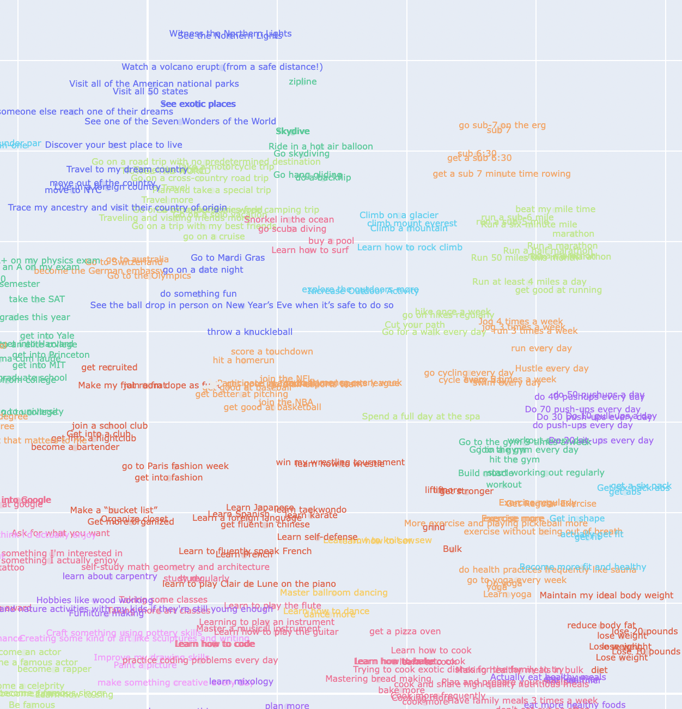

## Overview

- Chip is a social platform for building habits and goals
- I'm building this project to learn how to develop a complex mobile app, create a custom data pipeline, and use ML to see what insights I can derive based on habit data

## Notes

- Mobile app is currently built but still needs some fixes
- Currently only focusing on iOS

## Running

Frontend:

- Simulator
- Physical device: plug device in via USB, open `ChipProject.xcodeworkspace` in XCode and build

Brief demo: https://www.youtube.com/watch?v=WGds-UYgeeo

